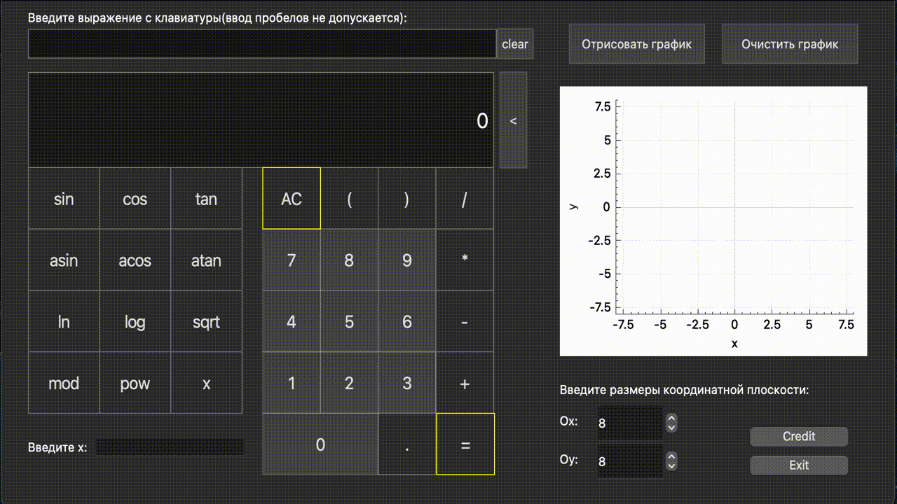

# `SmartCalc v1.0`

##  `Цель проекта:`
Реализация калькулятора с возможностью отрисовки графиков функций на координатной плоскости. 
## `Сборка:`
Для установки проекта на компьютере должны быть установлены зависимости:
- make
- gcc(g++)
- CMake
- Qt5
- Qt5::Core
- Qt5::Gui
- Qt5::Widgets
- Qt5::OpenGLWidgets

Порядок действий для установки:
- Склонируйте репозиторий
- Перейдите в директорию src и пропишите в консоль `make install`
## `Описание:`
При подсчете арифметических выражений в проекте использовася алгоритм Дейкстры. Его принцип заключается в переводе выражения из всем привычной инфиксной записи в обратную польскую нотацию и дальнейшего подсчета с приоритетом выполнения операторов.

Пример выражения, написанного в инфиксной форме:

> (4+3)×(6−2)

Пример выражения, написанного в обратной польской (бесскобочной) нотации:

> 4 3+ 6 2−×

## `Пример отрисовки графиков:`

